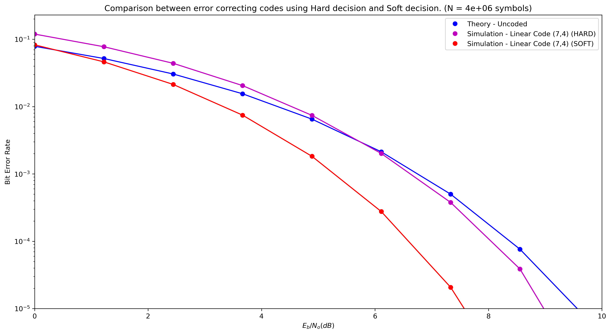

# Error Control Coding - Hard vs Soft decision

Comparison between error correcting codes using Hard decision and Soft decision.

## How do I run?

To run these scripts it is necessary to be running a version of python greater than 3.5 and with the following packages installed:
- numpy | It can be installed using pip with the command below:
    ```shell
    pip install numpy
    ```
- tabulate | It can be installed using pip with the command below:
    ```shell
    pip install tabulate
    ```

## Demonstration.ipynb file

Contains a jupyter notebook with a demonstration of usability

## Hard_vs_Soft.ipynb file

Contains the codes used to generate the results

## modules

Within this module are the files used to manipulate the elements and perform the operations

## Results

### Linear Code (6,3) | 3e+05 symbols and 15 points


### Linear Code (6,3) | 3e+06 symbols and 15 points


### Linear Code (7,4) | 4e+05 symbols and 15 points


### Linear Code (7,4) | 4e+06 symbols and 15 points


### Linear Code (8,4) | 4e+05 symbols and 15 points


### Linear Code (8,4) | 4e+06 symbols and 15 points


## References

1. dedewde
2. dedewdwd

## Social medias


[](https://www.linkedin.com/in/matheus-lobo-dos-santos/)
[](https://t.me/thematheusls)
